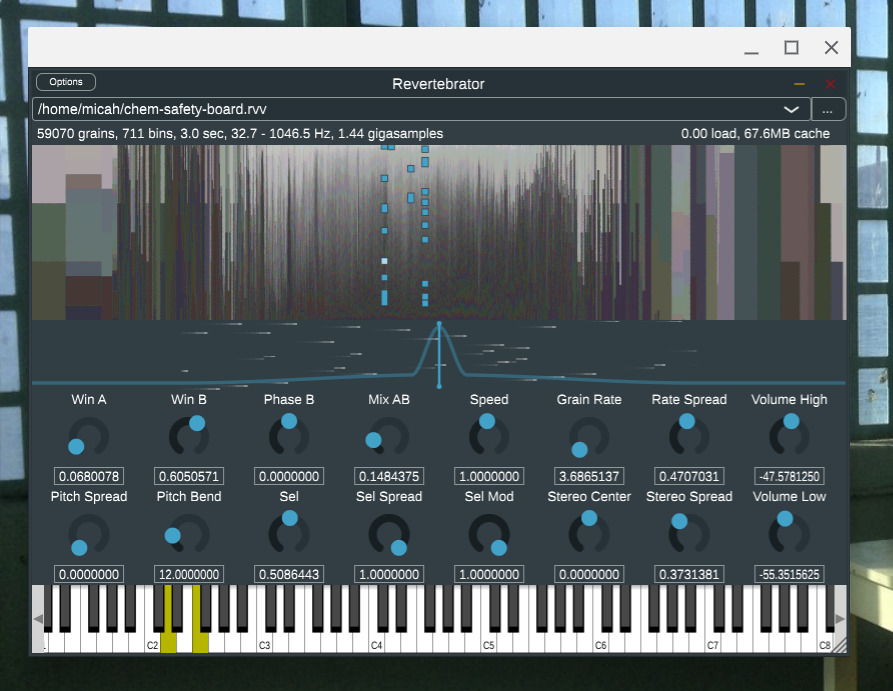

# Revertebrator

A weird granular synthesizer that uses large databases of pitch-sorted samples that stream from disk.



The instrument / plugin needs JUCE 6 to build.

The packed data files (`.rvv` extension) are actually ZIP archives containing FLAC audio data as well as index data for locating grains quickly. These packed files are built using `rvtool`, which needs Python 3.8 or later, either locally or via Docker.

```
usage: rvtool [-h] [-F FILE] {scan,forget,list,pack,export,import} ...

positional arguments:
  {scan,forget,list,pack,export,import}

options:
  -h, --help            show this help message and exit
  -F FILE               name of database file to use
                        [/home/USER/.local/share/rvtool.db]
```
```
usage: rvtool scan [-h] [-P N] [--block-size SEC] [--block-overlap SEC]
                   [--fmin HZ] [--fmax HZ] [--res ST]
                   SRC [SRC ...]

Run pitch detection on batches of audio files, updating the feature database

positional arguments:
  SRC                  files and directories to scan for audio

options:
  -h, --help           show this help message and exit
  -P N                 number of parallel jobs to run [20]
  --block-size SEC     length of audio blocks to process, in seconds [16]
  --block-overlap SEC  amount of overlap between audio blocks, in seconds [1]
  --fmin HZ            lowest pitch to detect, in hz [32.70319566257483]
  --fmax HZ            highest pitch to detect, in hz [1046.5022612023945]
  --res ST             pitch detection resolution in semitones [0.05]
```
```
usage: rvtool forget [-h] [-r HZ] [-c N] [-s SQL] [-f SQL] [--missing]
                     [--forget]
                     [GLOB ...]

Remove records from the audio feature database

positional arguments:
  GLOB        select file paths that match a glob pattern [all paths]

options:
  -h, --help  show this help message and exit
  -r HZ       select files of this sample rate [all sample rates]
  -c N        select files of this channel count [all channel counts]
  -s SQL      comma-separated list of expressions to sort files by [path]
  -f SQL      additional expression to filter results with [1]
  --missing   only operate on records for files that are missing
  --forget    actually forget; without this option, lists what would be
              removed
```
```
usage: rvtool list [-h] [-r HZ] [-c N] [-s SQL] [-f SQL] [GLOB ...]

Show information about the files in the audio feature database

positional arguments:
  GLOB        select file paths that match a glob pattern [all paths]

options:
  -h, --help  show this help message and exit
  -r HZ       select files of this sample rate [all sample rates]
  -c N        select files of this channel count [all channel counts]
  -s SQL      comma-separated list of expressions to sort files by [path]
  -f SQL      additional expression to filter results with [1]
```
```
usage: rvtool pack [-h] [-r HZ] [-c N] [-s SQL] [-f SQL] [-o DEST] [-w S]
                   [-n N] [--vprob P] [--res ST] [--min N] [--mark N]
                   [GLOB ...]

Compact a portion of the feature database into a self-contained archive

positional arguments:
  GLOB        select file paths that match a glob pattern [all paths]

options:
  -h, --help  show this help message and exit
  -r HZ       select files of this sample rate [all sample rates]
  -c N        select files of this channel count [all channel counts]
  -s SQL      comma-separated list of expressions to sort files by [path]
  -f SQL      additional expression to filter results with [1]
  -o DEST     name of packed output file [voice-20220526094414.rvv]
  -w S        maximum grain width in seconds [3.0]
  -n N        maximum number of grains per bin [1000]
  --vprob P   minimum voicing probability [0.99]
  --res ST    pitch binning resolution in semitones [0.01]
  --min N     discard bins with fewer than this minimum number of grains [3]
  --mark N    mark discontinuities with an N sample long noise [20]
```
```
usage: rvtool export [-h] [-r HZ] [-c N] [-s SQL] [-f SQL] [-o DEST]
                     [GLOB ...]

Export database information to JSON

positional arguments:
  GLOB        select file paths that match a glob pattern [all paths]

options:
  -h, --help  show this help message and exit
  -r HZ       select files of this sample rate [all sample rates]
  -c N        select files of this channel count [all channel counts]
  -s SQL      comma-separated list of expressions to sort files by [path]
  -f SQL      additional expression to filter results with [1]
  -o DEST     write output to a file [-]
```
```
usage: rvtool import [-h] [--replace] SRC [SRC ...]

Import database information from JSON

positional arguments:
  SRC         files to import JSON records from

options:
  -h, --help  show this help message and exit
  --replace   delete existing records for the same file paths before importing
```
